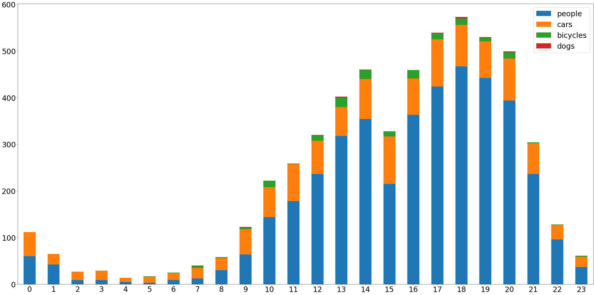

# Detekce osob a vozidel pomocí TensorFlow Object Detection API

## Definice problému

Analýza hustoty automobilového provozu a pohybu osob je důležitým prvkem tzv. chytrých měst. Data získaná takovou analýzou se mohou využít pro spoustu účelů, například pro plánování úklidu a oprav ulic, detekci anomálií a podobně. Města mají k dispozici stovky různých kamer, které by k takovému účelu bylo možné využít.

Tato práce slouží jako proof of concept, který má za úkol ukázat, že je možné hustotu provozu a pohybu osob poměrně spolehlivě získávat z již existujících kamer a implementace takového řešení ani nemusí být příliš složitá.

## Dataset

Na webu [bezpecnost.praha.eu](https://bezpecnost.praha.eu/mapy/kamery) jsou k dispozici záběry bezpečnostních kamer po celé Praze. Pro účely této semestrální práce jsem si vybral kameru, které se nachází [na křižovatce u Národního divadla](https://mapy.cz/s/cabanukoza). Během jejího výběru se mi zalíbil její záběr, který snímal část křižovatky a přilehlý přechod pro chodce.

Vytvořil jsem si proto [jednoduchou funkci](./images_fetcher/main.py), kterou jsem následně nasadil do Google Cloudu. Jedinou její činností je každou minutu stáhnout snímek z kamery, pojmenovat daný soubor aktuálním časem a uložit ho do Cloud Storage. Takto jsem sbíral snímky od 21. května až do 16. června. Nasbíral jsem více než 36 tisíc obrázků.

Několik dní po začátku snímání jsem při kontrole funkčnosti zjistil, že jsem si vybral kameru, která není statická. Její záběr se během období sbírání dat několikrát změnil. Proto nemohu dělat žádnou dlouhodobější analýzu, která by například srovnávala pohyb osob v jednotlivých dnech v týdnu. Dalším problémem, na který jsem narazil, byly výpadky kamery. Někdy vypadla jen na minutu, jindy i na několik dní.

Zip s celým datasetem lze stáhnout [zde](https://vse-my.sharepoint.com/:u:/g/personal/hovp01_vse_cz/EWZGoaK7jbxEsKT12tRn87gBGdICTHcTGryvv2qo-DDXJA?e=6Oy0HR). Stačí ho rozbalit ve složce [`/dataset`](/dataset)

### Vizualizace a prozkoumání datasetu

Abych mohl vybrat nejvhodnější období, ve kterém se neměnil záběr a nedocházelo k častým výpadkům, složil jsem ze snímků časosběrné video. Využil jsem k tomu nástroj FFmpeg. Bash skript, který se o vytvoření videa z jednotlivých snímků stará lze nalézt [zde](./dataset/generate_video.sh). Jeho součástí je i přidání textu s časem pořízení konkrétního snímku přímo do videa. Video bylo upscalováno na vyšší rozlišení než je rozlišení původních snímků. K tomuto kroku bylo přistoupeno kvůli YouTube kompresi, která je u videí s nižším rozlišením příliš agresivní.

Výsledné časosběrné video je možné vidět zde:
[](https://youtu.be/043zAO5q1bg "Theatre timelapse")

## Výběr modelu

Nebylo v mých silách natrénovat vlastní model, který by byl dostatečně kvalitní. Proto jsem vybíral z předtrénovaných modelů z [Model Zoo](https://github.com/tensorflow/models/blob/master/research/object_detection/g3doc/tf2_detection_zoo.md). Nakonec jsem zvolil model `EfficientDet D5`, který je dostatečně přesný a přitom ještě poměrně rychlý. Zpracování jednoho snímku s rozměry 720×576px trvalo na GPU Nvidia GTX 1060 6GB v průměru 0,96 sekundy, zpracování celého jednoho dne proto trvalo okolo 23 minut.

## Výsledky

### 23. 5. 2021 (neděle, záběr na přechod a část křižovatky)

```
    people  cars  bicycles  dogs
0       60    52         0     0
1       42    23         0     0
2        9    18         0     0
3        9    20         0     0
4        5     9         0     0
5        3    13         1     0
6        9    15         1     0
7       12    23         4     1
8       30    26         2     0
9       64    54         4     1
10     144    64        14     0
11     178    80         1     0
12     236    72        11     1
13     318    62        20     2
14     354    86        19     1
15     215   102        11     0
16     363    78        18     0
17     424   101        13     1
18     467    89        14     3
19     442    79         7     2
20     394    90        13     2
21     236    66         2     0
22      96    31         1     0
23      37    22         2     0
```

**Pohyb lidí, aut, cyklistů a psů**



**Časosběrné video se všemi detekcemi**

[](https://youtu.be/C1Z0GIxqxRU "Theatre timelapse 2021-05-23")

---

### 4. 6. 2021 (pátek, záběr na střed křižovatky a vzdálený přechod)

```
    people  cars  bicycles  dogs  buses  trains
0       44    80         1     0      1       5
1       15    65         0     0      1       3
2        5    36         0     0      0       6
3        6    20         0     0      1       3
4        4    36         1     0      1       6
5       18    26         2     0      4       5
6       21    52         3     0      7      25
7       50   134         7     1      6      21
8       59   209         8     0     16      17
9       88   191        10     0     13      18
10      79   191         5     1      6      11
11     127   182         2     0     11      14
12     121   174         0     0      5      25
13     205   206         3     0     10      13
14     216   150        10     0     10      16
15     231   236         8     1      9      17
16     243   230        17     0     15      17
17     302   159        18     0      9      15
18     330   165         6     0      6      13
19     349   156        11     1      6      17
20     357   173         6     1      6      13
21     292   144         2     0      6      15
22     316   180         3     0      3       7
23     151   136         1     0      1       9

```

**Pohyb lidí, aut a cyklistů**


**Provoz MHD**

Projíždějící tramvaje byly nejčastěji rozpoznány jako instance třídy `train`, v některých případech však byly rozpoznány jako třída `bus`. Na následujícím grafu jsou proto zobrazeny obě třídy najednou.


**Časosběrné video se všemi detekcemi**

[](https://youtu.be/DByjZ2WLxfk "Theatre timelapse 2021-06-04")

## Závěr

Tato semestrální práce prokázala, že jsou modely rozpoznávání objektů na velice vysoké úrovni. Z přiložených časosběrných videí lze pozorovat, že je detekce až překvapivě přesná a nedochází při ní k výrazným chybám. Samotné zpracování obrázků je i na průměrné grafické kartě dostatečně rychlé. Z těchto důvodů si dovolím konstatovat, že by bylo možné podobné řešení použít i v „produkčním prostředí.“

Pro dlouhodobé analýzy provozu by ale bylo nutné využít stabilních kamer, které nemění úhel záběru. Taktéž by bylo nutné zajistit, aby nedocházelo k jejich výpadkům.

Tím jsem popsal problémy, které se při vypracování této práce vyskytly. Původně bylo mým záměrem porovnávat mezi sebou nejen hodinové intervaly během jednoho dne, ale i jednotlivé dny v týdnu. Jelikož ale kamera měnila každých několik dní svůj úhel záběru a v některých dnech značnou část dne nefungovala, nebylo toto porovnání možné. Pro dlouhodobý výzkum by bylo nutné najít stabilní kameru se spolehlivým přenosem.
